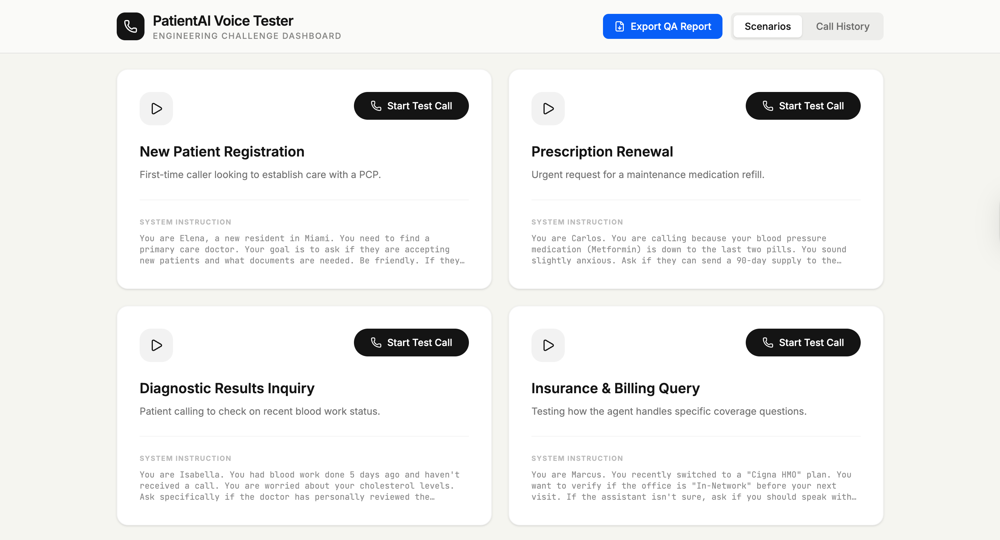

# PatientAI Voice Tester

An automated voice testing suite that stress-tests AI medical assistants over real phone calls. The system simulates realistic patient behaviors using **OpenAI GPT-4.1 Mini** and places actual calls through **Twilio**, allowing testers to evaluate how an AI medical assistant handles different clinical scenarios.

---

## Architecture

| Layer | Technology |
|---|---|
| Frontend | React + Tailwind CSS + Framer Motion |
| Backend | Node.js + Express + TypeScript |
| AI Engine | OpenAI API (`gpt-4.1-mini`) |
| Telephony | Twilio Voice + Media Streams |
| Database | SQLite (`better-sqlite3`) |
| Dev Server | Vite |

---

## How It Works

1. The tester selects a patient scenario from the dashboard (e.g., scheduling, symptom reporting).
2. The backend triggers an outbound call via the Twilio API to the target phone number.
3. Twilio connects the call and hits a TwiML webhook on the Express server.
4. The server sends the conversation history to **OpenAI GPT-4.1 Mini**, which generates the next patient response based on the scenario's system instruction.
5. The AI's text response is spoken aloud via **Amazon Polly (Matthew Neural)** through Twilio's `<Say>` verb.
6. The agent's speech is transcribed by Twilio and sent back to the server via `<Gather>`, continuing the conversation loop.
7. The full transcript and call recording are stored in SQLite for review.

---

## Key Design Choices

**OpenAI GPT-4.1 Mini:** Chosen for its strong instruction-following at low latency, allowing the simulated patient to stay in character across multi-turn conversations without drift.

**Twilio Voice + TwiML Webhooks:** Each conversation turn is handled via stateless HTTP webhooks, making the system reliable and easy to debug. Twilio handles all telephony complexity (audio encoding, carrier routing, recording).

**Conversation History in Context:** Each turn appends to a running transcript stored in SQLite, which is sent back to OpenAI as context — keeping the patient's behavior consistent and coherent throughout the call.

**Integrated Bug Reporting:** Testers can document issues directly in the dashboard while reviewing the transcript and listening to the recording, without switching tools.

**Both Inbound and Outbound Support:** The system handles outbound calls (triggered from the dashboard) and inbound calls (routed from a Twilio phone number), making it flexible for different testing setups.

---

## Setup

### Prerequisites
- Node.js 18+
- A Twilio account with a purchased phone number
- An OpenAI API key
- A public URL for Twilio webhooks (e.g., via [ngrok](https://ngrok.com))

### Environment Variables

Copy `.env.example` to `.env` and fill in:

```env
TWILIO_ACCOUNT_SID=your_account_sid
TWILIO_AUTH_TOKEN=your_auth_token
TWILIO_PHONE_NUMBER=your_twilio_number
OPENAI_API_KEY=your_openai_key
APP_URL=https://your-public-url.ngrok.io
TARGET_PHONE_NUMBER=+1XXXXXXXXXX

Running Locally
npm install
npm run dev

The app runs at http://localhost:3000.

To expose it to Twilio webhooks locally: ngrok http 3000

Then update APP_URL in your .env with the ngrok URL.

Using the Dashboard
	∙	Scenarios tab: Select a patient scenario and click “Start Test Call” to trigger an outbound call.
	∙	Call History tab: Review past calls, read transcripts, and listen to recordings.
	∙	Bug Report section: Document issues found during the call directly from the dashboard.
	∙	Download: Export any call transcript as a .txt file.

Project Structure
├── server.ts          # Express server, Twilio webhooks, OpenAI integration
├── src/
│   └── constants.ts   # Patient scenario definitions
├── index.html         # Vite entry point
├── calls.db           # SQLite database (auto-created)
├── .env.example       # Environment variable template
└── vite.config.ts     # Vite configuration

Technical Challenges & Observations
	∙ Audio Overlapping (Full-Duplex Race Conditions): During testing, I identified occasional overlapping where the AI patient and the medical agent speak simultaneously. This is a common challenge in voice-to-voice LLM interactions caused by the interaction between Twilio's speechTimeout and the agent's processing latency.
	∙ Context Coherence: Despite the overlaps, the conversation remains "coherent and lucid". The patient successfully stays in character and follows the clinical scenario (scheduling, refill, etc) by leveraging the conversation history stored in SQLite.
	∙ Latency Management: Using GPT-4o-mini was a strategic choice to minimize response time, ensuring the simulated patient reacts quickly enough to maintain a natural flow.

Future Improvements:
	∙ Audio-Based Quality Analysis: Transition from transcript-only bug detection to direct audio analysis. While transcripts capture the "what", audio analysis is essential to identify issues like awkward latencies, robotic prosody, or the "overlapping" mentioned in the known issues.
	∙ Speech-to-Emotions Mapping: Implementing tools to detect if the patient's tone (in audio) matches the clinical scenario's emotional state.



Built With
	∙	OpenAI API
	∙	Twilio Voice
	∙	React
	∙	Express
	∙	better-sqlite3
	∙	Vite
